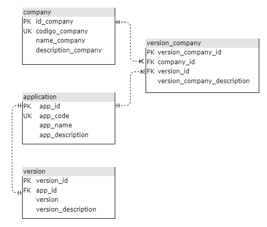

# Proyecto de Prueba Técnica

Este proyecto fue desarrollado como parte de una prueba técnica. Dada la estructura de la BD. El objetivo fue crear una **API REST**, que permitiera hacer CRUD de cada una de las tablas. Ademas de permitir por medio de un SP poblar las tablas dadas desde el contenido de la tabla "tmp_llenar_campos". La prueba se realizó utilizando **Spring Boot**, **Swagger**, **arquitectura hexagonal** y **stored procedures**. A continuación, se detallan los aspectos más relevantes del proyecto.

## Características principales

- **Arquitectura Hexagonal**: El proyecto sigue el patrón de arquitectura hexagonal para promover una clara separación de responsabilidades y facilitar la mantenibilidad y escalabilidad.
- **Swagger**: El proyecto incluye integración con **Swagger** para generar la documentación de la API de manera automática. Puedes acceder a la interfaz de Swagger en la siguiente URL:
  
  [http://localhost:8080/swagger-ui/index.html](http://localhost:8080/swagger-ui/index.html)

## Modelo Entidad-Relación (MER)

El modelo de la base de datos está representado en el siguiente diagrama:



## Requisitos

- **Java 17 o superior**
- **MySQL** para la base de datos

## Configuración

Antes de ejecutar la aplicación, debes crear un archivo `.env` en la raíz del proyecto con la siguiente configuración:

```env
DB_NAME=${Nombre de la Base de Datos}
DB_HOST=${Servidor}
DB_PORT=${Puerto}
DB_USER=${Usuario}
DB_PASS=${Contraseña}